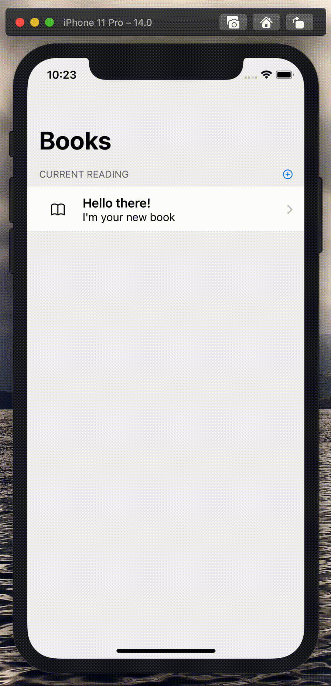

# Books-App
An offline iOS App built with SwiftUI for readers that helps them manage your current reads (inspired by WWDC2020)

### Notes
The app has been built for trying the new SwiftUI functionalities introduced during WWDC2020. Topics such as CoreData integration in SwiftUI, Previews and Combine are covered.
